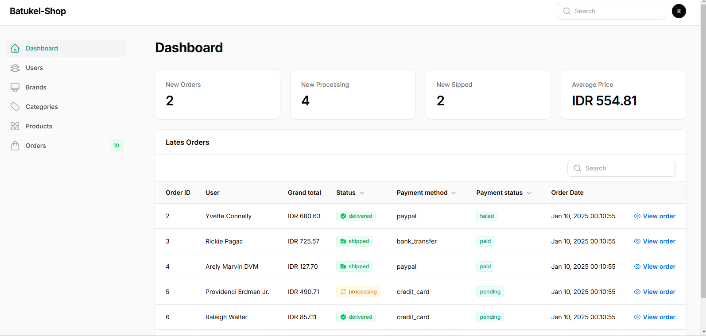
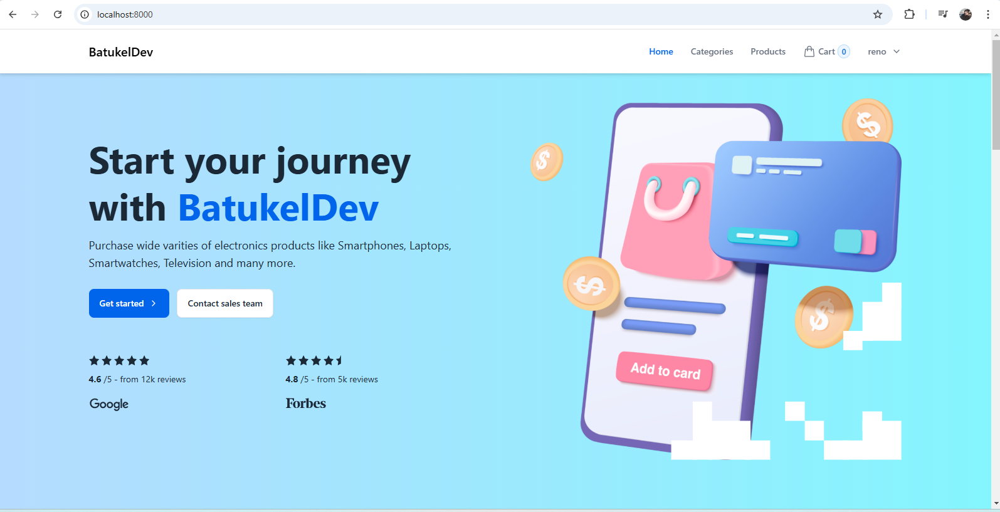
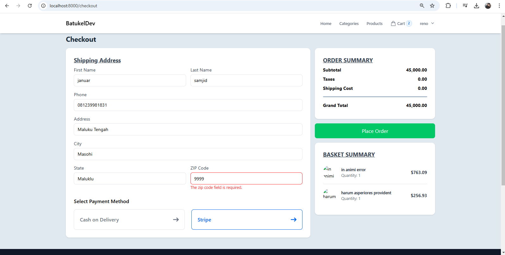
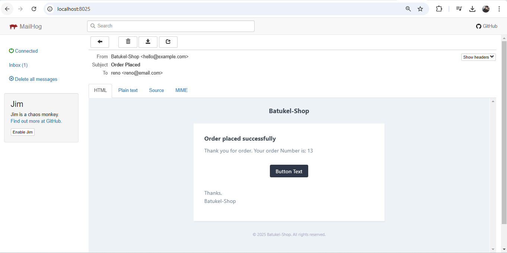

# E-Commerce with Laravel, Livewire, and Filament

## About Project
A modern e-commerce web application built using Laravel, powered by Livewire for dynamic interactions, and managed with Filament admin panel.

## Features
- Product Management
- Category Management
- Shopping Cart
- User Authentication
- Order Processing
- Admin Dashboard
- Email Notifications
- Stripe Payment Integration

## Tech Stack
- Laravel
- Livewire
- Filament
- MySQL
- Tailwind CSS
- Mailer
- Stripe API

## Installation
1. Clone the repository
```bash
git clone https://github.com/yourusername/ECommerceLivewireFilament.git
```
2. Install dependencies
```bash
composer install
npm install
```
3. Configure environment
```bash
cp .env.example .env
php artisan key:generate
```
4. Set up mail and Stripe configurations in .env
```bash
MAIL_MAILER=smtp
MAIL_HOST=your-smtp-host
MAIL_PORT=your-smtp-port
MAIL_USERNAME=your-username
MAIL_PASSWORD=your-password

STRIPE_KEY=your-stripe-public-key
STRIPE_SECRET=your-stripe-secret-key
```
5. Run migrations
```bash
php artisan migrate
```
6. Serve application
```bash
php artisan serve
```

## Screenshot
<div align="center">
    
    <p><i>Admin Dashboard</i></p>
    
    <p><i>Home</i></p>
    
    <p><i>Products Management</i></p>
    
    <p><i>Checkout</i></p>
    
    <p><i>mail</i></p>
</div>


## License
MIT License


